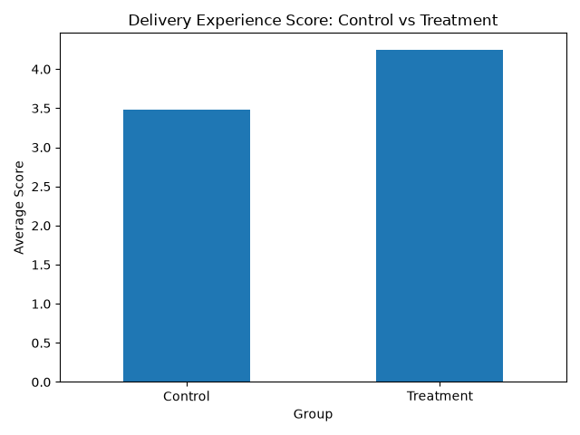
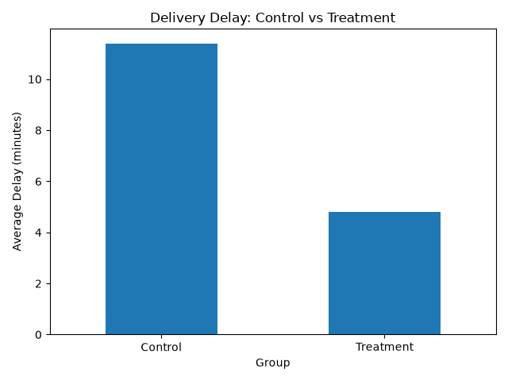
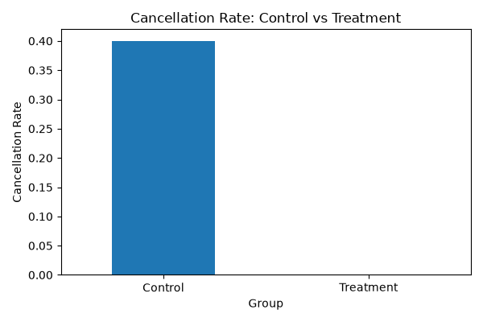
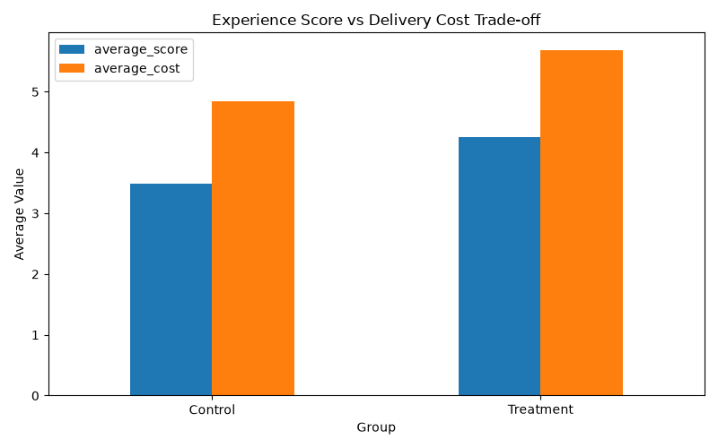

# Delivery Experience Experimentation Lab

## Business Question

Can Flexible Delivery improve customer satisfaction while maintaining operational efficiency?

## Project Overview

This project analyzes the impact of a delivery experience improvement using experimentation methods.

The goal is to understand whether a Flexible Delivery option improves customer experience while balancing operational costs.

## Tools

- Python
- Pandas
- Jupyter Notebook
- SQL (SQLite)
- Statistical Testing
- Git & GitHub

## Analysis Approach

The project includes:

- Data exploration
- Customer delivery analysis
- SQL-based KPI analysis
- Customer segmentation
- A/B testing
- Hypothesis testing
- Confidence intervals
- Operational impact analysis

## Experiment Results

| Metric | Result |
|---|---:|
| Control experience score | 3.48 |
| Treatment experience score | 4.25 |
| Improvement (Lift) | +0.77 |
| P-value | 0.00028 |
| Delivery delay improvement | -6.6 minutes |

## Operational Impact

Flexible Delivery showed:

- Higher customer experience scores
- Lower delivery delays
- Lower cancellation rates

The improvement came with an increase in delivery cost, which should be monitored during rollout.

## Recommendation

Recommend a controlled rollout of Flexible Delivery while continuing to monitor:

- Delivery cost
- Customer retention
- Repeat orders
- Long-term customer value

## Author

Data Analytics Experimentation Project
## Experiment Results

### Customer Experience Improvement

The treatment group showed a significant improvement in customer experience score.

### Delivery Delay Reduction

Flexible Delivery reduced average delivery delays compared to the control group.

### Cancellation Rate Improvement

The treatment group achieved a lower cancellation rate.

### Cost vs Experience Trade-off

While customer experience improved, delivery cost increased. This trade-off should be monitored during rollout.

